# GAN in Numpy
This is a very simple step by step implementation of GAN using only numpy.  
Without the use of GPU, it may takes too much time to generate all the numbers.  
To get the result quickly using only CPU, I suggest working with one number.  

## How to use
In bash or command line(windows) or powershell under this directory

```bash
$ python gan.py
#this will generator a random number [0, 9]

$ python gan.py 9 0 8
#add the number(s) you want the program to generate, e.g. 0(to generate 0) or 0 8(to generate 0 and 8)
```

### What's included 
* Vanilla GAN
* Xavier Initialization
* SGD

### Requirements  
* Numpy  
* Matplotlib/PIL (to visualize/save results)  

## Network  


## Results


## image per epoch
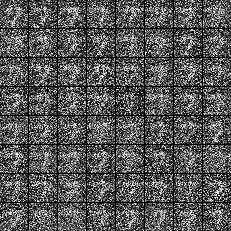
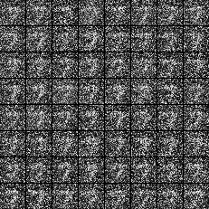
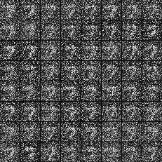
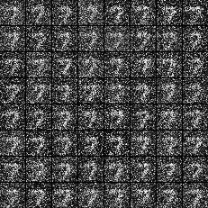
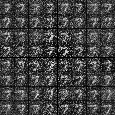
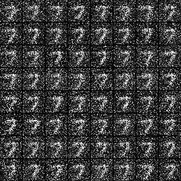
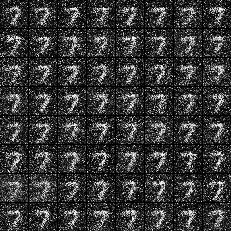
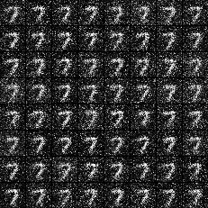
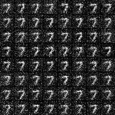
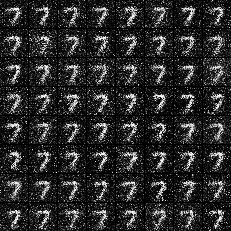
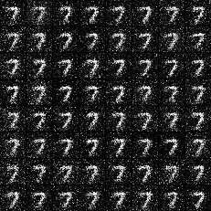

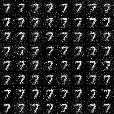
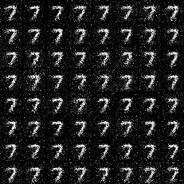
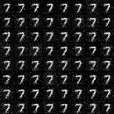

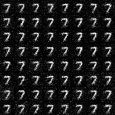


#### reference
[generative adversarial networks](https://arxiv.org/pdf/1406.2661.pdf)
